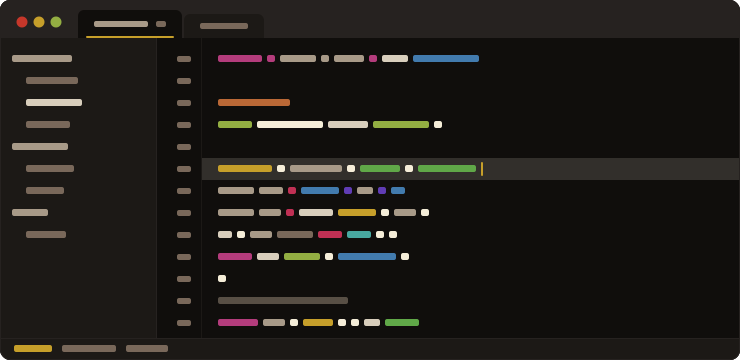
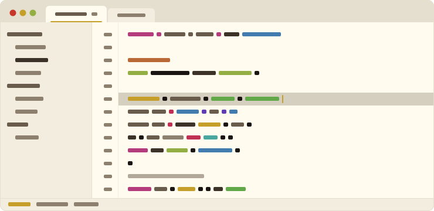

 

  
  <h1 align="center">Flynt</h1>

Warm tones. Zero visual noise.

  <a href="https://flynt-theme.github.io/flynt">Palette</a>
  ·
  <a href="https://flynt-theme.github.io/flynt#philosophy">Philosophy</a>
  ·
  <a href="https://flynt-theme.github.io/flynt#style-guide">Style Guide</a>
  ·
  <a href="https://flynt-theme.github.io/flynt#ports">Ports</a>

 

<table align="center" border="0" cellspacing="0" cellpadding="8"><tr>
  <td></td>
  <td></td>
</tr></table>

## Contributing

There are plenty of apps out there waiting to be warmed up with a bit of Flynt. Use [strike](https://github.com/flynt-theme/strike) to build your port from a template, then open a PR or issue - accepted ports live under the [flynt-theme](https://github.com/flynt-theme) org.

Already a fan? GitHub stars and word of mouth go a long way.
